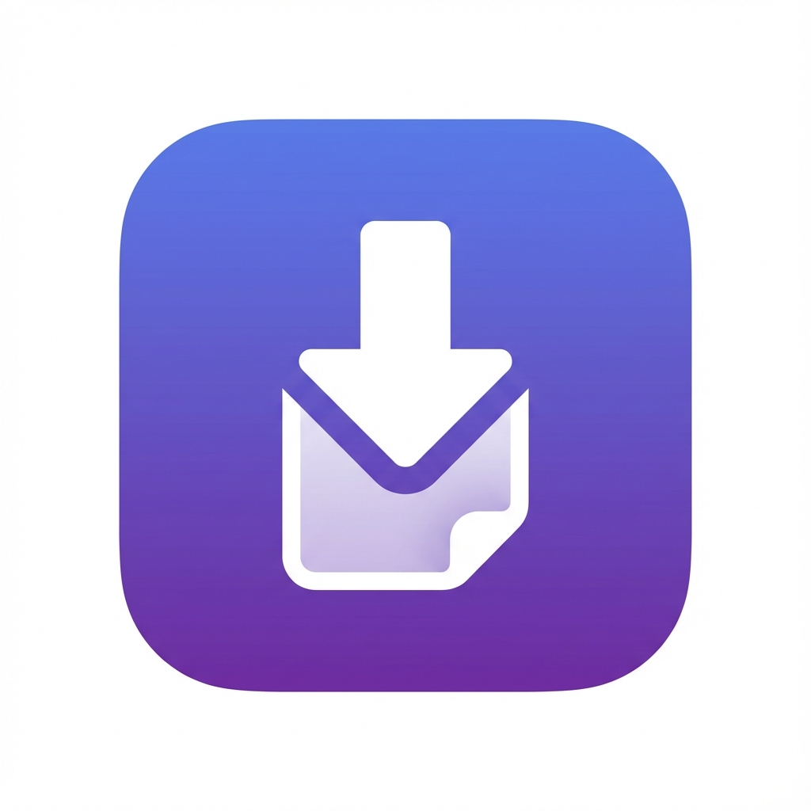

# ChatGPT Export Pro 🚀

A powerful Chrome extension for capturing, managing, and exporting ChatGPT conversations into multiple formats with premium UI/UX and advanced features.



## ✨ Features

### 🎯 Core Features
- **Multi-Format Export**: Export conversations to PDF, Markdown, HTML, and Plain Text
- **One-Click Export**: Floating button directly in ChatGPT interface
- **Conversation Management**: Save, tag, and organize conversations locally
- **Smart Capture**: Automatically detects and preserves formatting (code blocks, tables, lists)
- **Right-Click Export**: Quick export via context menu
- **Keyboard Shortcuts**: 
  - `Ctrl+Shift+P` (Mac: `Cmd+Shift+P`) - Export to PDF
  - `Ctrl+Shift+M` (Mac: `Cmd+Shift+M`) - Export to Markdown

### 🎨 Customization Options
- **Theme Selection**: Light and Dark mode exports
- **Flexible Options**:
  - Include/exclude timestamps
  - Include/exclude system messages
  - Custom cover pages
  - Adjustable formatting
- **Auto-Save**: Optionally save conversations locally on export

### 💾 Conversation Management
- **Local Storage**: All conversations stored securely on your device
- **Search & Filter**: Find conversations quickly
- **Tagging System**: Organize with custom tags
- **No Cloud Upload**: Complete privacy - everything stays local

### 🎯 Premium UI/UX
- Modern, gradient-based design
- Smooth animations and transitions
- Glassmorphism effects
- Fully responsive interface
- Professional and polished appearance

## 📦 Installation

### Install from Source (Developer Mode)

1. **Download the extension**:
   - Clone or download this repository
   - Extract to a folder on your computer

2. **Open Chrome Extensions page**:
   - Navigate to `chrome://extensions/`
   - Enable "Developer mode" (toggle in top right)

3. **Load the extension**:
   - Click "Load unpacked"
   - Select the folder containing the extension files
   - The extension icon should appear in your toolbar

4. **Start using**:
   - Visit [ChatGPT](https://chat.openai.com)
   - You'll see a floating "Export" button on the page
   - Click the extension icon for more options

## 🚀 Usage

### Quick Export
1. Open a ChatGPT conversation
2. Click the floating **Export** button in the bottom-right
3. Select your desired format (PDF, Markdown, Word, Text, HTML)
4. Your file will download automatically

### Using the Popup Dashboard
1. Click the extension icon in your toolbar
2. See current conversation info and message count
3. Choose export format and customization options
4. Click export button

### Context Menu Export
1. Right-click anywhere on a ChatGPT page
2. Select "Export to [format]"
3. File downloads automatically

### Managing Saved Conversations
1. Click extension icon
2. Go to "Saved" tab
3. View all saved conversations
4. Search, export, or delete as needed

## ⚙️ Customization

### Export Options
- **Theme**: Choose between light and dark theme for exports
- **Timestamps**: Include or exclude message timestamps
- **Cover Page**: Add a professional cover page to exports
- **Auto-Save**: Automatically save conversations to local storage

### Keyboard Shortcuts
You can customize keyboard shortcuts in Chrome:
1. Go to `chrome://extensions/shortcuts`
2. Find "ChatGPT Export Pro"
3. Customize the shortcuts

## 🏗️ Project Structure

```
chatgpt-to-pdf/
├── manifest.json           # Extension configuration
├── background.js           # Background service worker
├── content/
│   ├── chatgpt-injector.js # Content script for ChatGPT
│   └── styles.css          # Floating button styles
├── popup/
│   ├── popup.html          # Popup interface
│   ├── popup.css           # Popup styles
│   └── popup.js            # Popup logic
├── lib/
│   ├── exporter.js         # Main export orchestrator
│   └── vendor/             # Third-party libraries
├── assets/
│   ├── icons/              # Extension icons
│   └── styles/             # Global styles
└── README.md               # This file
```

## 🔒 Privacy & Security

- **100% Local**: All processing happens on your device
- **No Data Collection**: We don't collect, store, or transmit your data
- **No External Servers**: Exports are generated client-side
- **Secure Storage**: Conversations stored in Chrome's local storage
- **Open Source**: Full transparency - review the code yourself

## 🛠️ Technical Details

### Built With
- **Manifest V3**: Latest Chrome extension standard
- **Vanilla JavaScript**: No framework dependencies
- **jsPDF**: PDF generation (for PDF exports)
- **Modern CSS**: Gradients, animations, glassmorphism

### Browser Compatibility
- Chrome (recommended)
- Edge (Chromium-based)
- Brave
- Other Chromium browsers

### Permissions Used
- `activeTab`: Access ChatGPT page content
- `storage`: Save conversations and settings
- `contextMenus`: Right-click export menu
- `downloads`: Save exported files
- `scripting`: Inject export functionality

## 🐛 Troubleshooting

### Export button not showing
- Refresh the ChatGPT page
- Check if extension is enabled
- Ensure you're on chat.openai.com or chatgpt.com

### Exports not working
- Check browser console for errors
- Ensure popup blockers aren't interfering
- Try reloading the extension

### Conversation not detected
- Wait for page to fully load
- Refresh the page
- Check that there are messages in the conversation

## 🔮 Future Enhancements

Planned features for future releases:
- Word (.docx) export support
- Cloud sync (Google Drive, Dropbox)
- AI-powered summaries and takeaways
- Batch export multiple conversations
- Advanced tagging and organization
- Conversation comparison tool
- Template customization
- Export scheduling

## 📝 License

MIT License - feel free to use and modify for your needs

## ❤️ Contributing

Contributions are welcome! Please feel free to submit a Pull Request.

## 🙏 Acknowledgments

- ChatGPT for the amazing AI experience
- jsPDF for PDF generation capabilities
- The open-source community

## 📧 Support

For issues, feature requests, or questions:
- Open an issue on GitHub
- Check existing issues first

---

**Made with ❤️ for ChatGPT users**

Enjoy exporting your conversations! 🎉
